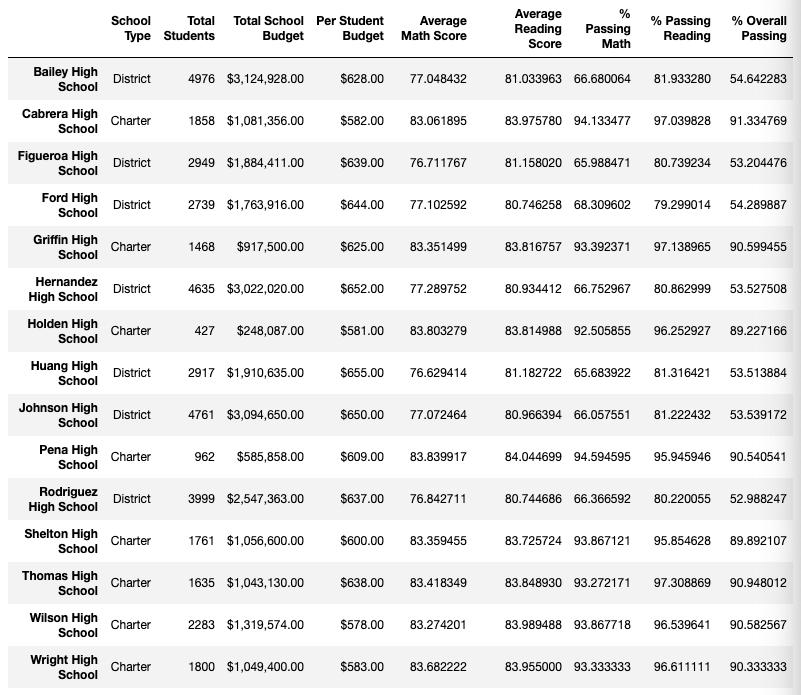
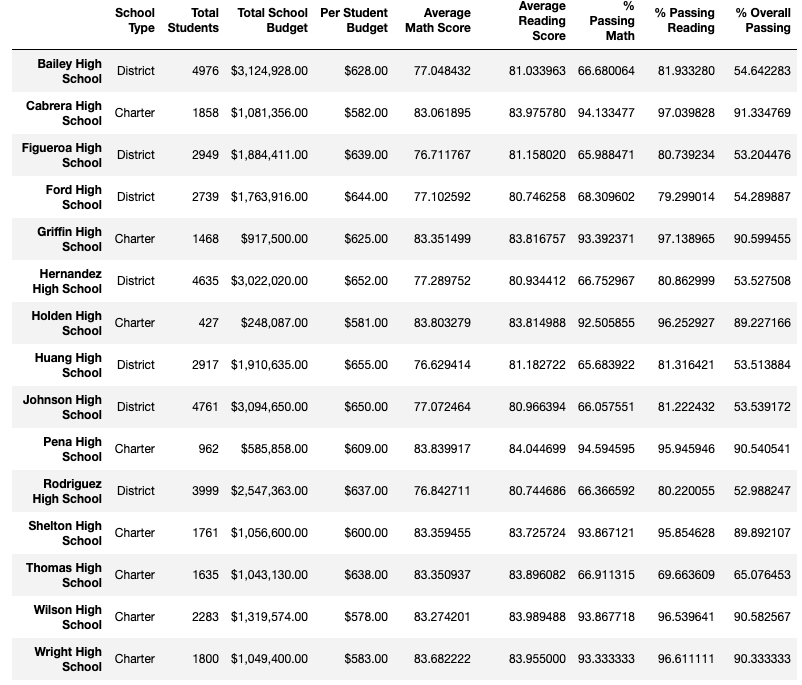

# School_District_Analysis
Author: Jerome Simmons
Python programming of school district data

## Background
Using Python, we have conducted an analysis of school district data (PyCitySchools_Module_Results). The school board has notified us that the analysis shows evidence of academic dishonesty and Thomas High School (THS) ninth grader math and reading data have been altered. 

We have been asked to replace the math and reading scores for THS ninth graders and repeat our school district analysis (PyCitySchools_Challenge). Using both analysis reports, we have been asked to describe how the changes to the Thomas High School ninth grade data affected the overall analysis.

## Results
In this section, we will review how removing the THS ninth grade data impacted performance.
### District Level Summary
By removing the THS ninth grade data, we found district level performance declined overall.
* Average math score fell 0.1 points from 79.0 to 78.9
* % passing math feel 0.2 percentage points from 75.0 to 74.8
* % passing reading fell 0.3 percentage points from 86.0 to 85.7
* % passing both math and reading fell 0.1 points from 65.0 to 64.9

### School Level Summary
The impact of removing the ninth grade THS students is very negative at the school level. By removing the ninth grade data at THS, the percent of students passing math and/or reading declined by over 25 percentage points.
* the percent of overall passing students fell from 90.94 to 65.07
* the perent of students passing math fell from  93.27% to 66.91%
* the percent of students passing reading fell from 97.3% to 69.66%

### Performance Relative to Other Schools
By replacing the ninth graders' math & reading scores, THS relative to other schools moves from the second best in terms of % Overall Passing to middle of the pack.

### Math & reading scores by grade
THS Math and reading scores by grade are unchanged among 10th, 11th, and 12th graders.

### Scores by school spending
Scores by school spending are unchanged.

### Scores by school size
Scores by school size are unchanged.

### Scores by school type
Scores by school type are unchanged.

## Summary
By replacing the ninth grade THS results with NaNs, we have found that THS school performance declined across 3 key variables (1) the percent of overall passing students, (2) percent of students passing math, and (3) percent of students passing reading. Across the entire district, performance fell in terms of average math score, % passing math, % passing reading, and % passing both math and reading. 
